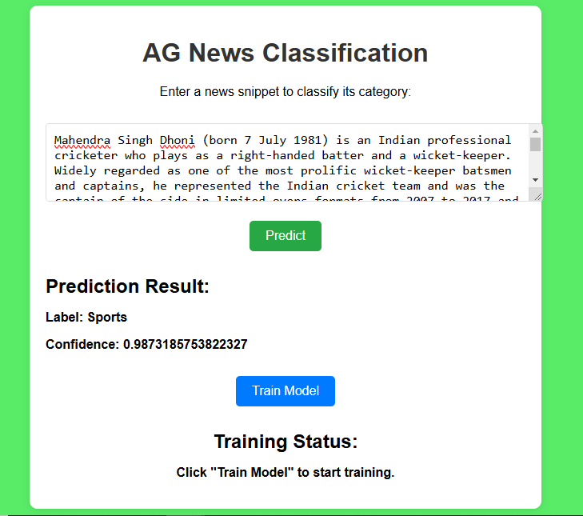
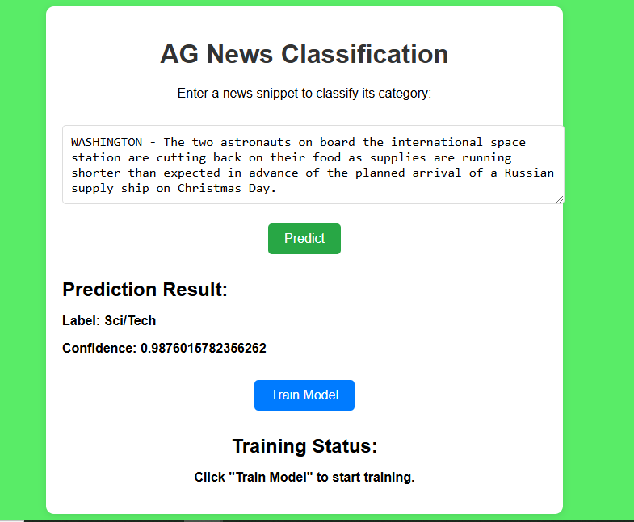
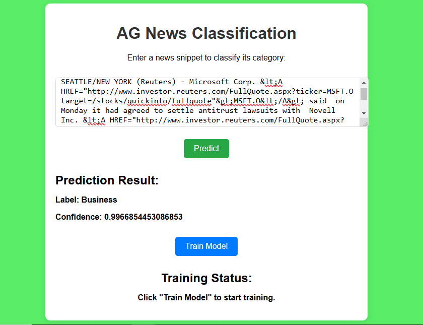

# AG News Classification

# Introduction

This project showcases the creation of an **end-to-end MLOps pipeline** for **AG News Classification**, a task that involves categorizing news articles into four predefined categories: **World, Sports, Business, and Sci/Tech**. The primary objective was to design a scalable, automated system for machine learning model development and deployment, ensuring high performance and real-world applicability.

We employed a robust MLOps framework that integrates state-of-the-art transformer models, including **BERT, ALBERT, SBERT, XLNet, and RoBERTa**, achieving the **highest accuracy of 94.53% with RoBERTa**. The system is complemented by a user-friendly **frontend developed using HTML, CSS, and JavaScript**, with a **backend powered by FastAPI** for real-time predictions.

To ensure reliability and scalability, we addressed server response timeouts using **Redis and Celery** for **asynchronous task handling**. Deployment was achieved using **AWS EC2, and the CI/CD pipeline was automated using CircleCI**, providing a streamlined workflow from development to production.

## Overview of the MLOps Pipeline

The **MLOps pipeline** incorporates all critical stages of machine learning development in a cohesive workflow. The process begins with **data ingestion**, where the **AG News dataset** is collected and preprocessed. This is followed by **data validation** to ensure data quality and integrity. Next, the **data transformation** stage prepares the text data through tokenization and vectorization for downstream tasks.

**Model training** leverages advanced transformer models to classify news articles into the four AG News categories, with **RoBERTa** achieving the **highest accuracy of 94.53%**. **Model evaluation** identifies the best-performing model based on metrics like **accuracy and F1 score**. Finally, the **Model deployment** stage hosts the best model for real-time inference using **AWS infrastructure**. This pipeline exemplifies the integration of machine learning best practices to solve a real-world text classification problem.

## Deployment and CI/CD Integration

The deployment of the **MLOps pipeline** was achieved using **AWS EC2**, providing a scalable and reliable environment for hosting the trained models and backend services. The system ensures that the best model is continuously deployed, allowing for real-time predictions via the **FastAPI** backend. To automate the integration and deployment processes, we implemented a **CI/CD pipeline using CircleCI**. This pipeline automates tasks such as testing, building **Docker** images, pushing them to an **AWS Elastic Container Registry (ECR)**, and deploying updates to the **EC2 instance**. The use of **CircleCI** ensures rapid and error-free deployment, enabling seamless updates and monitoring of the pipeline.

## Addressing Server Response Timeout

A critical challenge in deploying real-time prediction services is managing **server response times**. To address the **1-minute response timeout limitation**, we implemented **Redis and Celery** for asynchronous task handling. Redis serves as the message broker, while **Celery** handles task execution in the background, allowing the server to handle predictions without timeouts. This architecture ensures that users receive timely responses, even under high-load conditions, enhancing the system's robustness.

## Frontend Integration

The project includes a user-friendly **frontend** developed using **HTML, CSS, and JavaScript**. This interface interacts with the backend **FastAPI** services, allowing users to upload news articles and receive predicted categories in real time. The frontend design emphasizes simplicity and responsiveness, ensuring accessibility across devices. Its seamless integration with the backend leverages REST APIs to handle prediction requests, providing a cohesive user experience.

## Tech Stack Used
- **Language**: Python
- **Deep Learning Framework**: PyTorch
- **NLP Library**: Hugging Face Transformers (e.g., BERT, Roberta)
- **Backend**: FastAPI
- **Frontend**: HTML, CSS, JavaScript
- **Task Management**: Celery
- **Message Queue**: Redis

## Infrastructure
- **Containerization**: DockerHub
- **Deployment**: AWS Elastic Container Registry (ECR), EC2, and S3 for deployment and storage.
- **Version Control**: GitHub
- **CI/CD Pipeline**: CircleCI (CI/CD automation)

## System Design


## Dataset

The **AG News Topic Classification Dataset** is a benchmark dataset for text classification tasks. It comprises news articles sourced from over **2,000 outlets**, originally gathered by the academic search engine ComeToMyHead, active since 2004. Designed for research in fields like data mining, information retrieval, and text classification, this dataset is widely utilized in academic and experimental studies.

You can download an existing dataset. Here is the Dataset [Link](https://www.kaggle.com/datasets/amananandrai/ag-news-classification-dataset/data)

## Dataset Information

This dataset, curated by Xiang Zhang, includes four major news categories extracted from the original AG corpus. Each category is balanced with:

- **Training samples**: 30,000 per class (total: 120,000 samples)
- **Testing samples**: 1,900 per class (total: 7,600 samples)

### The four categories are:

1) **World**
2) **Sports**
3) **Business**
4) **Science/Technology**

### Files Structure

- **classes.txt**: Lists the four categories.

- **train.csv and test.csv**: Contains labeled news articles with columns for the class index (1–4), title, and description.

- **Formatting**: Titles and descriptions are enclosed in double quotes (") with internal double quote is escaped by 2 double quotes (""). Line breaks are represented as \n.


#### Dataset Details<a id='dataset-details'></a>
<pre>
Dataset Name             : AG News Classification Dataset
Number of Class          : 4
Number/Size of Dataset   : Total      : 120000 (12 MB)
                           Training   : 120000
                           Testing    :  7600

</pre>
## Results<a id='results-'></a>
We have achieved following results with Roberta based pretrained model named ***roberta-base*** for the classofication of 4 classes like, **World, Sports, Business, and Sci/Tech**.

<pre>
<b>Performance Metrics </b>
F1 Score                                          : 94.56%
Training Accuracy                                 : 94.53%
Testing Accuracy                                  : 93.23%
</pre>

## Installation
    
The Code is written in Python 3.8.19. If you don't have Python installed you can find it here. If you are using a lower version of Python you can upgrade using the pip package, ensuring you have the latest version of pip.

## Run Locally

### Step 1: Clone the repository.
```bash
git clone https://github.com/jatin-12-2002/AG_News_Classification
```
### Step 2: Navigate to the project directory.
```bash
cd AG_News_Classification
```
### Step 3: Create a conda environment after opening the repository.
```bash
conda create -p env python=3.8 -y
```
```bash
source activate ./env
```
### Step 4: Install the requirements.
```bash
pip install -r requirements.txt
```

### Step 5: Create AWS IAM user with following Permissions Enabled.

* **AdministratorAccess**
* **AmazonEC2ContainerRegistryFullAccess**
* **AmazonEC2FullAccess**


### Step 6: Configure your AWS.
```bash
aws configure
```

### Step 7: Enter your AWS Credentials of IAM User.
```bash
AWS_SECRET_ACCESS_KEY = ""
AWS_ACCESS_KEY_ID = ""
AWS_REGION = "us-east-1"
AWS_FOLDER = Press Enter and move on
```

### Step 8: Prepare your Dataset zip file named archive.zip
Your Zip file should contain following folders and files in this order:
```bash
archive.zip
│
├── train.csv
│
├── test.csv
```

* **Here is my Datset Zip: [LINK](data/archive.zip)**

### Step 9: Upload the Dataset zip file to your S3 Bucket.
```bash
aws s3 cp path/to/your/archive.zip s3://your-bucket-name/archive.zip
```

### Step 10: Install Redis.
```bash
sudo apt-get update
```
```bash
sudo apt-get install redis-server
```

### Step 11: Start the Redis Server(usually done on port 6379 by default).
```bash
sudo service redis-server start
```

### Step 12: Check if Redis is running. It should return **PONG** if everything is working fine.
```bash
redis-cli ping
```

### Step 13 (Optional): Add best_model folder in your Project structure
Follow this Step if you don't want to train model for 50 epochs as It will take a long time to complete training. I had already trained model named as **best_model** folder for 50 epochs.

As **best_model** folder is very large in size(500 MB), So I cannot push it into github repository directly. So, you had to update it manually and you had to keep it in your Project structure.

You can download the **best_model** folder from [here](https://drive.google.com/drive/folders/1BeTokrRsgHxum9kzpcIfASl4E2okYWbp?usp=sharing)

### Step 14: Upload the best_model folder in your S3 Bucket
```bash
aws s3 cp /path/to/best_model s3://your-bucket-name/best_model --recursive
```

### Step 15: Start the Celery Worker. In a new terminal window, activate the environment then run:
```bash
celery -A celery_app worker --loglevel=info
```

### Step 16: Run the FastAPI application. In another terminal, start your FastAPI application with Uvicorn
```bash
uvicorn app:app --host 0.0.0.0 --port 8080 --workers 2
```

### Step 17: Prediction application
```bash
http://localhost:8080/
```

### Step 18: If model is not trained and not present in your S3 bucket
```bash
Run the training Pipeline by clicking on train button in FastAPI UI
```

## Prediction Outputs




## AWS Deployment Steps
### Step 1 - Login to AWS console.

### Step 2 - Create IAM user for deployment with following Permissions Enabled

* **AdministratorAccess**
* **AmazonEC2ContainerRegistryFullAccess**
* **AmazonEC2FullAccess**

### Important Points:
1. **EC2 access** : It is virtual machine

2. **ECR**: Elastic Container registry to save your docker image in aws


### Description: About the deployment in the Backend

1. Build docker image of the source code

2. Push your docker image to ECR

3. Launch Your EC2 

4. Pull Your image from ECR in EC2

5. Lauch your docker image in EC2

### Step 3 - Create ECR repo to store/save docker image
```bash
Save your ECR URI: 022499021177.dkr.ecr.us-east-1.amazonaws.com/agnews
```

### Step 4 - Create EC2 machine (Ubuntu)
```bash
Use t2.large or greater size instances only as it is a Natural Language Processing project
```

### Step 5 - Connect EC2 Instance and Install docker in EC2 Machine:

### Run all the commands given in the **circleci_setup_template.sh** file, in the EC2 Instance Command Line.

### Step 6 - Configure EC2 as self-hosted runner in CircleCI:
```bash
CircleCI-->Self-hosted Runner--> Choose Yes, agree all the terms
```

### Step 7 - Setup CicleCI secrets of your Project:
```bash
AWS_ACCESS_KEY_ID=

AWS_SECRET_ACCESS_KEY=

AWS_REGION = us-east-1

AWS_ECR_REGISTRY_ID = "Your AWS account:ID"
```

### Step 8 - Configure your inbound rule in EC2 Instance:
1. Go inside the security
2. Click on security group
3. Configure your inbound rule with certain values
4. Port 8080 0.0.0.0/0 for anywhere traffic TCP/IP protocol
5. Port 6379 (Redis) 0.0.0.0/0 for anywhere traffic TCP/IP protocol

### Step 9 - Run the Public Port of EC2 Instance
```bash
http://your-ec2-public-ip:8080
```

## Conclusion

1. Successfully implemented an **end-to-end MLOps pipeline** for **AG News classification**, achieving state-of-the-art accuracy of **94.53%** with the **RoBERTa model**.

2. Addressed scalability and reliability issues, such as server response timeouts, using **Redis and Celery** for asynchronous task handling.

3. Deployed the pipeline to production using **AWS EC2 and ECR**, ensuring a robust and scalable infrastructure.

4. **Automated CI/CD** processes with **CircleCI**, streamlining development, testing, and deployment workflows.

5. Delivered a **user-friendly frontend integrated with a FastAPI backend**, providing real-time predictions and seamless interaction for users.