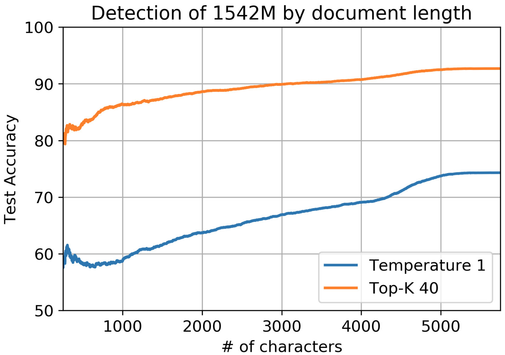
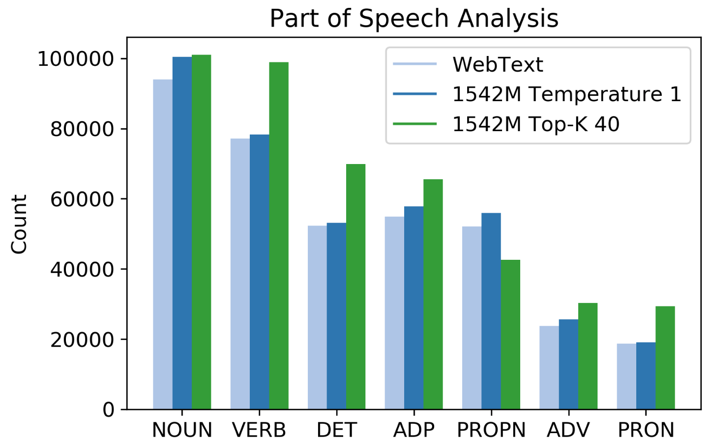
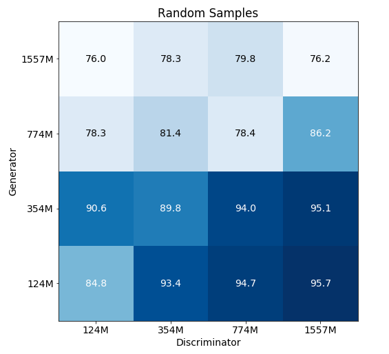
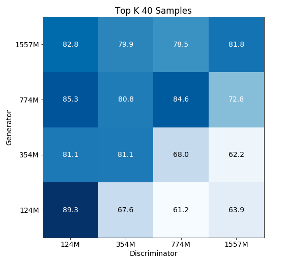

# Fake News Detection Using GPT-2

## Model Training Process

### Simple baseline

#### We've provided a starter baseline which trains a logistic regression detector on TF-IDF unigram and bigram features, in [`baseline.py`](./baseline.py).

### Initial Analysis

#### The baseline achieves the following accuracies:

| Model | Temperature 1 | Top-K 40 |
| ----- | ------ | ------ |
| 117M  | 88.29% | 96.79% |
| 345M  | 88.94% | 95.22% |
| 762M  | 77.16% | 94.43% |
| 1542M | 74.31% | 92.69% |



#### Unsurprisingly, shorter documents are harder to detect and performance improves gradually with length. Accuracy of detection of short documents of 500 characters (a long paragraph) is about 15% lower.



**Truncated sampling, which is commonly used for high-quality generations from the GPT-2 model family, results in a shift in the part of speech distribution of the generated text compared to real text. A clear example is the underuse of proper nouns and overuse of pronouns which are more generic. This shift contributes to the 8% to 18% higher detection rate of Top-K samples compared to random samples across models.**

### Finetuning

#### When run on samples from the finetuned GPT-2 full model, detection rate falls from 92.7% to 70.2% for Top-K 40 generations.  Note that about half of this drop is accounted for by length, since Amazon reviews are shorter than WebText documents.

### "Zero-shot" baseline

**We attempt a second baseline which uses a language model to evaluate total log probability, and thresholds based on this probability.  This baseline underperforms relative to the simple baselinie.  However, we are interested in further variants, such as binning per-token log probabilities.**

### Initial analysis

#### Here, we show results of log-prob based detection for both standard (t=1) and Top-K 40 generations.



**The main result is that GPT-2 detects itself 81.8% of the time in the easy case of Top-K 40 generations. This is pretty constant across model sizes.  All underperform relative to the simple baseline.**

**For random samples, results are unsurprising. Bigger models are better able to realize that generated text is still kind of weird and "random". Detection rates also go down as generators get better.**

**For Top-K 40, results are perhaps more surprising. Using a bigger model as a discriminator does not really improve detection rates across the board (the smallest GPT-2 model does as well at detecting full GPT-2 as full GPT-2), and a bigger model does not "detect down well" - that is, full GPT-2 is actually kind of bad at detecting an adversary using small GPT-2.**

**An important difference is that while in the random samples case, generations are less likely than real data, in the Top-K 40 case, they are more likely.**

### Finetuning

#### When detecting samples from our finetuned GPT-2 full model using GPT-2 full, we observe a 63.2% detection rate on random samples (drop of 13%) and 76.2% detection rate with Top-K 40 samples (drop of 5.6%)


## GPT-2-Output-Dataset

This dataset contains:
- 250K documents from the WebText test set
- For each GPT-2 model (trained on the WebText training set), 250K random samples (temperature 1, no truncation) and 250K samples generated with Top-K 40 truncation

**We look forward to the research produced using this data!**

### Download

For each model, we have a training split of 250K generated examples, as well as validation and test splits of 5K examples.

All data is located in Kaggle. Here is the [link](https://www.kaggle.com/datasets/abhishek/gpt2-output-data).

There, you will find files:

- `webtext.${split}.jsonl`
- `small-117M.${split}.jsonl`
- `small-117M-k40.${split}.jsonl`
- `medium-345M.${split}.jsonl`
- `medium-345M-k40.${split}.jsonl`
- `large-762M.${split}.jsonl`
- `large-762M-k40.${split}.jsonl`
- `xl-1542M.${split}.jsonl`
- `xl-1542M-k40.${split}.jsonl`

where split is one of `train`, `test`, and `valid`.

We've provided a script to download all of them, in `download_dataset.py`.

### Detectability baselines

We're interested in seeing research in detectability of GPT-2 model family generations.

We provide some [initial analysis](detection.md) of two baselines, as well as [code](./baseline.py) for the better baseline.

Overall, we are able to achieve accuracies in the mid-90s for Top-K 40 generations, and mid-70s to high-80s (depending on model size) for random generations.  We also find some evidence that adversaries can evade detection via finetuning from released models.

## INSTALLATION
Installation of this project is pretty easy. Please do follow the following steps to create a virtual environment and then install the necessary packages in the following environment.

### Step-1: Clone the repository to your local machine:
```bash
    git clone https://github.com/jatin-12-2002/Fake_News_Detection_GPT-2
```

### Step-2: Navigate to the project directory:
```bash
    cd Fake_News_Detection_GPT-2
```

### Step 3: Create a conda environment after opening the repository

```bash
    conda create -p env python=3.6 -y
```

```bash
    source activate ./env
```

### Step 4: Install the requirements
```bash
    pip install -r requirements.txt
```

### Step 5: Install the pytorch from the link
```bash
    https://pytorch.org/get-started/locally/
```
```bash
    pip3 install torch torchvision torchaudio --index-url https://download.pytorch.org/whl/cpu
```

### Step 6: Add the pre-trained model in your project structure. I had trained the model already.
As **detector-base.pt** model is very large in size(400 MB), So I cannot push it into github repository directly. So, you had to update it manually in and you had to insert the model in your project structure.

You can download the **detector-base.pt** model from [here](https://drive.google.com/file/d/1gmRkcygtGTXoNRSLiJTDXzmffubVIEle/view?usp=sharing)

### Step-7: Run the application:
```bash
    python -m detector.server detector-base.pt --port 8000
```

### Step-8: Prediction application:
```bash
    http://localhost:8000/
```